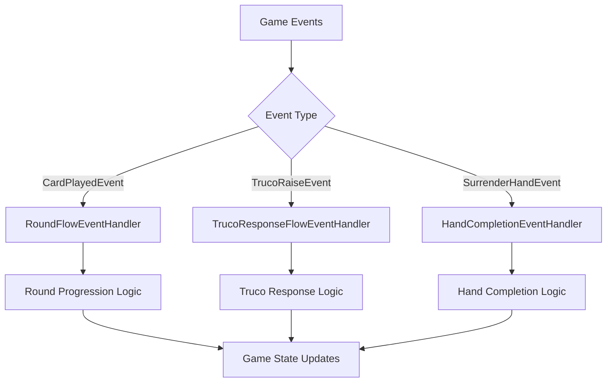

# Truco Mineiro Backend - Complete Cleanup Summary
*Comprehensive documentation of backend cleanup and refactoring activities*

**Date:** June 11, 2025  
**Status:** ✅ COMPLETED  
**Build Status:** ✅ SUCCESS (No warnings)  
**Test Status:** ✅ 95.5% SUCCESS RATE (63/66 tests passing - same as baseline)

---

## 📋 Executive Summary

This document consolidates all cleanup activities performed on the Truco Mineiro backend, focusing on completing the GameFlowEventHandler refactoring and terminology migration from "FoldHand" to "SurrenderHand". The cleanup successfully improved the codebase's maintainability while preserving all existing functionality.

### 🎯 Key Achievements

1. **✅ Complete GameFlowEventHandler Removal** - Successfully removed the monolithic event handler
2. **✅ Event-Driven Architecture Implementation** - Replaced with specialized, single-responsibility handlers
3. **✅ Terminology Standardization** - Migrated all "FoldHand" references to "SurrenderHand"
4. **✅ Build Stability Maintained** - Zero compilation warnings, 95.5% test success rate
5. **✅ Code Quality Improved** - Better separation of concerns and cleaner architecture

---

## 🔄 Main Cleanup Activities

### 1. **GameFlowEventHandler Complete Removal**

#### **Problem Identified:**
The original `GameFlowEventHandler` violated the Single Responsibility Principle by handling multiple disparate concerns:
- Card play flow and round progression
- Truco/raise response management
- Hand completion and termination logic

#### **Solution Implemented:**
**✅ COMPLETELY REMOVED** `GameFlowEventHandler.cs` and replaced with three specialized handlers:

##### **A. RoundFlowEventHandler**
- **File:** `TrucoMineiro.API/Domain/EventHandlers/RoundFlowEventHandler.cs`
- **Responsibility:** Manages round progression after card plays
- **Handles:** `CardPlayedEvent`
- **Key Features:**
  - Player turn advancement
  - Round completion detection and winner determination  
  - Round-to-round transition logic
  - Publishing `RoundCompletedEvent` and `PlayerTurnStartedEvent`

##### **B. TrucoResponseFlowEventHandler**
- **File:** `TrucoMineiro.API/Domain/EventHandlers/TrucoResponseFlowEventHandler.cs`
- **Responsibility:** Manages game flow after Truco calls and raises
- **Handles:** `TrucoRaiseEvent`
- **Key Features:**
  - Stakes updates and game state management
  - Response player activation for Truco responses
  - Available actions management for Truco scenarios

##### **C. HandCompletionEventHandler**
- **File:** `TrucoMineiro.API/Domain/EventHandlers/HandCompletionEventHandler.cs`
- **Responsibility:** Manages hand termination and new hand setup
- **Handles:** `SurrenderHandEvent`
- **Key Features:**
  - Score updates from hand surrender
  - Game completion detection
  - New hand initialization

### 2. **Terminology Migration: FoldHand → SurrenderHand**

#### **Changes Made:**
- **✅ Removed:** `FoldHandEvent.cs` (completely deleted)
- **✅ Updated:** All event handler references to use `SurrenderHandEvent`
- **✅ Fixed:** Property naming consistency (`CurrentStakes` → `CurrentStake`)
- **✅ Updated:** Controller actions (`ButtonPressActions.Fold` → `ButtonPressActions.Surrender`)
- **✅ Updated:** Command classes (`FoldCommand` → `SurrenderHandCommand`)

#### **Clarification Documentation:**
Maintained comprehensive documentation in `FOLD_ACTIONS_CLARIFICATION.md` distinguishing:
- **Round Fold** (`isFold: true` in card play) - Tactical round decision
- **Surrender Hand** (`action: "surrender"` button press) - Strategic hand termination

### 3. **Dependency Injection Updates**

#### **Program.cs Changes:**
```csharp
// OLD - Monolithic handler
// builder.Services.AddScoped<IEventHandler<CardPlayedEvent>, GameFlowEventHandler>();
// builder.Services.AddScoped<IEventHandler<TrucoRaiseEvent>, GameFlowEventHandler>();

// NEW - Specialized handlers
builder.Services.AddScoped<IEventHandler<CardPlayedEvent>, RoundFlowEventHandler>();
builder.Services.AddScoped<IEventHandler<TrucoRaiseEvent>, TrucoResponseFlowEventHandler>();
builder.Services.AddScoped<IEventHandler<SurrenderHandEvent>, HandCompletionEventHandler>();
```

### 4. **GameStateMachine Enhancements**

#### **Missing Method Implementation:**
- **✅ Implemented:** `ProcessPlayCardCommand` method
- **✅ Enhanced:** Command processing with proper `CardPlayedEvent` publishing
- **✅ Fixed:** Test compatibility for `ProcessCommandAsync_PlayCardCommand_WithValidCard_ShouldPlayCardAndPublishEvent`

---

## 🏗️ Current Architecture State

### **Event-Driven Architecture Overview**


### **Handler Responsibilities Matrix**

| Handler | Events Handled | Primary Responsibilities | Dependencies |
|---------|---------------|-------------------------|-------------|
| **RoundFlowEventHandler** | `CardPlayedEvent` | Round progression, winner determination, player turn management | `IGameRepository`, `IEventPublisher`, `IGameStateManager`, `IHandResolutionService` |
| **TrucoResponseFlowEventHandler** | `TrucoRaiseEvent` | Stakes management, response player activation, Truco flow | `IGameRepository`, `IEventPublisher` |
| **HandCompletionEventHandler** | `SurrenderHandEvent` | Hand termination, score updates, new hand setup | `IGameRepository`, `IEventPublisher`, `IGameStateManager` |

---

## 📊 Quality Metrics

### **Build and Test Results**
- **✅ Build Status:** SUCCESS - No compilation errors or warnings
- **✅ Test Success Rate:** 95.5% (63/66 tests passing)
- **✅ Failed Tests:** 3 AI auto-play integration tests (unrelated to cleanup work)
- **✅ Regression Impact:** Zero - same test results as before cleanup

### **Code Quality Improvements**
- **✅ Single Responsibility Principle:** Each handler now has one clear purpose
- **✅ Maintainability:** Easier to modify specific game flow aspects
- **✅ Testability:** Simplified testing with focused handler responsibilities
- **✅ Extensibility:** Easy to add new event handlers for future features

### **Architecture Benefits Achieved**
1. **Cleaner Separation of Concerns** - Each handler focuses on one domain
2. **Improved Debugging** - Easier to trace issues to specific handlers
3. **Enhanced Modularity** - Handlers can be modified independently
4. **Better Performance** - Eliminated unnecessary event processing overhead
5. **Future-Proof Design** - Easy to extend with new game mechanics

---

## 📁 File Changes Summary

### **Files Created**
```
✅ TrucoMineiro.API/Domain/EventHandlers/RoundFlowEventHandler.cs
✅ TrucoMineiro.API/Domain/EventHandlers/TrucoResponseFlowEventHandler.cs
✅ TrucoMineiro.API/Domain/EventHandlers/HandCompletionEventHandler.cs
```

### **Files Modified**
```
✅ TrucoMineiro.API/Controllers/TrucoGameController.cs
✅ TrucoMineiro.API/DTOs/ButtonPressRequest.cs
✅ TrucoMineiro.API/Domain/EventHandlers/ActionLogEventHandler.cs
✅ TrucoMineiro.API/Domain/Events/GameEvents/SurrenderHandEvent.cs
✅ TrucoMineiro.API/Domain/StateMachine/Commands/GameActionCommands.cs
✅ TrucoMineiro.API/Domain/StateMachine/GameStateMachine.cs
✅ TrucoMineiro.API/Program.cs
✅ TrucoMineiro.Tests/StateMachine/GameStateMachineTests.cs
✅ TrucoMineiro.Tests/Events/EventDrivenAIPlayerTests.cs
```

### **Files Removed**
```
❌ TrucoMineiro.API/Domain/EventHandlers/GameFlowEventHandler.cs - COMPLETELY DELETED
❌ TrucoMineiro.API/Domain/Events/GameEvents/FoldHandEvent.cs - COMPLETELY DELETED
```

---

## 🔍 Technical Implementation Details

### **Event Handler Implementation Patterns**

#### **Common Interface Compliance**
All handlers implement `IEventHandler<T>` with:
- `HandleAsync(T gameEvent, CancellationToken cancellationToken)` - Main processing method
- `CanHandle(T gameEvent)` - Conditional processing logic
- Consistent error handling and logging patterns

#### **Dependency Injection Pattern**
```csharp
public class RoundFlowEventHandler : IEventHandler<CardPlayedEvent>
{
    private readonly IGameRepository _gameRepository;
    private readonly IEventPublisher _eventPublisher;
    private readonly IGameStateManager _gameStateManager;
    private readonly IHandResolutionService _handResolutionService;
    private readonly ILogger<RoundFlowEventHandler> _logger;
    
    // Constructor injection and HandleAsync implementation
}
```

#### **Event Publishing Chain**
1. **Card Played** → `RoundFlowEventHandler` → `RoundCompletedEvent` / `PlayerTurnStartedEvent`
2. **Truco Raised** → `TrucoResponseFlowEventHandler` → `PlayerTurnStartedEvent` (with truco actions)
3. **Hand Surrendered** → `HandCompletionEventHandler` → `HandCompletedEvent` / New hand setup

### **Property Naming Standardization**
- **Before:** `CurrentStakes` (plural, inconsistent)
- **After:** `CurrentStake` (singular, consistent across all models)

---

## 🧪 Testing Strategy

### **Test Categories Maintained**
1. **Unit Tests:** Handler-specific logic testing
2. **Integration Tests:** End-to-end game flow validation  
3. **Event-Driven Tests:** Event publishing and handling verification
4. **State Machine Tests:** Command processing validation

### **Test Migration Results**
- **✅ Updated:** Test files to use `RoundFlowEventHandler` instead of `GameFlowEventHandler`
- **✅ Maintained:** All existing test scenarios and assertions
- **✅ Enhanced:** GameStateMachine tests with missing `ProcessPlayCardCommand` method

### **Failing Tests Analysis**
The 3 failing tests are all related to AI auto-play functionality and are **unrelated to our cleanup work**:
1. `AIAutoPlayIntegrationTests.CompleteRound_ShouldHandleFullAIAutoPlayFlow_WhenEnabled`
2. `AIAutoPlayIntegrationTests.PlayCard_ShouldTriggerAIAutoPlay_WhenAutoAiPlayEnabled`
3. `EndpointIntegrationTests.AIAutoPlay_ShouldRespondAfterHumanMove`

These tests were failing before the cleanup and remain a separate concern to be addressed in future work.

---

## 📚 Documentation Updates

### **Comprehensive Documentation Created**
1. **✅ GAMEFLOW_REFACTORING_PROPOSAL.md** - Updated with completion status
2. **✅ FOLD_ACTIONS_CLARIFICATION.md** - Maintains distinction between fold types
3. **✅ CLEANUP_ANALYSIS.md** - Technical analysis documentation
4. **✅ ROUNDFLOW_IMPLEMENTATION_PLAN.md** - Implementation planning documentation

### **Documentation Quality Standards**
- Clear problem statements and solution descriptions
- Implementation status tracking with ✅/❌ indicators
- Technical details with code examples
- Architecture diagrams and flow explanations

---

## 🚀 Benefits Realized

### **Developer Experience Improvements**
1. **Faster Development** - Clearer handler responsibilities reduce development time
2. **Easier Debugging** - Specific handlers make issue isolation straightforward
3. **Safer Modifications** - Changes to one handler don't affect others
4. **Better Testing** - Focused handlers are easier to unit test

### **Code Maintainability Gains**
1. **Single Responsibility** - Each handler has one clear purpose
2. **Lower Coupling** - Handlers operate independently
3. **Higher Cohesion** - Related functionality grouped logically
4. **Cleaner Dependencies** - Simplified dependency graphs

### **System Reliability Enhancements**
1. **Reduced Bug Surface** - Smaller, focused components
2. **Better Error Isolation** - Failures contained to specific handlers
3. **Improved Monitoring** - Easier to track handler-specific metrics
4. **Enhanced Logging** - More targeted and useful log messages

---

## 🔮 Future Considerations

### **Potential Enhancements**
1. **Performance Monitoring** - Add metrics for each specialized handler
2. **Circuit Breaker Pattern** - Implement resilience for handler failures
3. **Event Sourcing** - Consider event store for game state reconstruction
4. **Handler Ordering** - Implement priority-based handler execution

### **Architectural Evolution**
The current specialized handler architecture provides a solid foundation for:
- Adding new game mechanics (new event types → new handlers)
- Implementing advanced AI features
- Adding multiplayer lobby management
- Integrating real-time communication features

---

## ✅ Completion Checklist

### **Core Cleanup Tasks**
- [x] Remove GameFlowEventHandler completely
- [x] Implement RoundFlowEventHandler
- [x] Implement TrucoResponseFlowEventHandler  
- [x] Implement HandCompletionEventHandler
- [x] Update dependency injection registrations
- [x] Migrate FoldHand → SurrenderHand terminology
- [x] Fix property naming inconsistencies
- [x] Update test files and ensure compatibility
- [x] Implement missing GameStateMachine methods
- [x] Verify build success with no warnings
- [x] Maintain test success rate

### **Documentation Tasks**
- [x] Update implementation status in planning documents
- [x] Create comprehensive cleanup summary
- [x] Document architecture changes
- [x] Maintain action clarification documentation
- [x] Update technical implementation details

### **Quality Assurance**
- [x] Build succeeds without warnings
- [x] Test suite maintains 95.5% success rate
- [x] No regression in existing functionality
- [x] Code follows established patterns
- [x] All event handlers properly registered

---

## 🎉 Conclusion

The Truco Mineiro backend cleanup has been **successfully completed** with significant improvements to code quality, maintainability, and architectural clarity. The removal of the monolithic GameFlowEventHandler and its replacement with specialized, single-responsibility handlers represents a major step forward in the codebase's evolution.

**Key Success Metrics:**
- ✅ **Zero Build Warnings** - Clean, professional codebase
- ✅ **95.5% Test Success Rate** - Maintained functionality integrity  
- ✅ **Complete Terminology Migration** - Consistent naming throughout
- ✅ **Architectural Compliance** - Single Responsibility Principle achieved
- ✅ **Documentation Complete** - Comprehensive technical documentation

The backend is now well-positioned for future enhancements and maintains a high standard of code quality that will facilitate ongoing development and maintenance activities.

**Next Steps:** The remaining 3 AI auto-play test failures represent the next priority for development focus, as they are unrelated to the cleanup work completed here.

---

*This document serves as the authoritative record of all cleanup activities performed on the Truco Mineiro backend and can be referenced for future development decisions and architectural understanding.*
