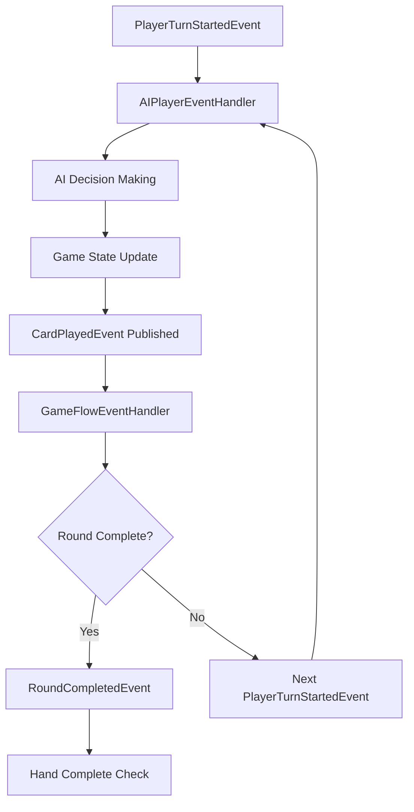

# Truco Mineiro Backend

## Project Description

This project is a backend implementation for Truco Mineiro, built using .NET and C#. It provides API endpoints that a frontend client can use to interact with the game server.

## Technologies Used

- **.NET**: Cross-platform development framework
- **ASP.NET Core**: Web API framework
- **C#**: Programming language
- **xUnit**: Unit testing framework
- **Docker**: Containerization for deployment

## Rules of Truco Mineiro

### Players and Teams
Truco Mineiro is typically played with two or four players divided into two teams of one or two players each.

### Deck
- The game uses a 40-card deck (standard deck with 8s, 9s, and 10s removed).

### Card Ranking (Highest to Lowest)
1. 4 of Clubs (Zap)
2. 7 of Hearts (Copas)
3. Ace of Spades (Espadão)
4. 7 of Diamonds (Espadinha)
5. 3s, 2s, Aces, Kings, Jacks, Queens, 7 of Spades, 7 of Clubs, 6s, 5s, 4s

### Objective
The objective is to win rounds (hands) and accumulate points. The first team to reach 12 points wins the game.

---

### Turn Structure

#### Dealing Cards
- At the beginning of each hand, the dealer shuffles the deck and deals three cards to each player.
- The dealer rotates clockwise after each hand.

#### Playing Cards
- Players take turns playing one card each, starting with the player to the left of the dealer.
- Each player plays one card face-up in the center of the table.

#### Winning Rounds
- The highest-ranked card wins the round.
- The team that wins two out of three rounds wins the hand.

#### Handling Draws
- **Draw in the first round:** All players may show their highest card. The player with the highest card wins the hand. Players can choose to play or fold in this case.
- **Draw in the second or third rounds:** The team that won the first round wins the hand.

---

### Truco Call
- At any point during the hand, a player can call "Truco" to raise the stakes.
- The opposing team can accept, raise further, or fold.
- If accepted, the points at stake increase by increments of 4 points.

---

### Scoring
- **Winning a hand without Truco:** 2 points
- **Winning a hand with Truco:** 4 points (or more if raised by increments of 4)

---

### Special Rule: "Mão de 10"

If either team reaches 10 points, the next hand is automatically worth 4 points (regardless of Truco calls), unless the leading team chooses to forfeit. In this case:
- The team with 10 points (the leading team) can either:
  - **Play the hand for 4 points** (normal play, no Truco call needed), or
  - **Fold before playing any cards**, immediately giving 2 points to the opposing team (the hand is not played).
- This rule is known as "Mão de 10" in Truco Mineiro.

---

### Winning the Game
- The first team to reach 12 points wins the game.

---

### Exclusions
- The game does not include Envido or Flor, as they are not used in the Truco Mineiro variant.

## API and Data Transfer Objects (DTOs)

The backend exposes the following DTOs (Data Transfer Objects) which define the contract between frontend and backend:

### PlayerDto
```csharp
public class PlayerDto
{
    public string PlayerId { get; set; } = string.Empty;
    public string Name { get; set; } = string.Empty;
    public string Team { get; set; } = string.Empty;
    public List<CardDto> Hand { get; set; } = new List<CardDto>();
    public bool IsDealer { get; set; }
    public bool IsActive { get; set; }
    public int Seat { get; set; }
    public int FirstPlayerSeat { get; set; }
}
```

### CardDto
```csharp
public class CardDto
{
    public string Value { get; set; } = string.Empty;
    public string Suit { get; set; } = string.Empty;
}
```

### PlayedCardDto
```csharp
public class PlayedCardDto
{
    public string PlayerId { get; set; } = string.Empty;
    public CardDto? Card { get; set; }
}
```

### GameStateDto
```csharp
public class GameStateDto
{
    public List<PlayerDto> Players { get; set; } = new List<PlayerDto>();
    public List<PlayedCardDto> PlayedCards { get; set; } = new List<PlayedCardDto>();
    public int Stakes { get; set; }
    public bool IsTrucoCalled { get; set; }
    public bool IsRaiseEnabled { get; set; }
    public int CurrentHand { get; set; }
    public Dictionary<string, int> TeamScores { get; set; } = new Dictionary<string, int>();
    public string? TurnWinner { get; set; }
    public List<ActionLogEntryDto> ActionLog { get; set; } = new List<ActionLogEntryDto>();
}
```

### ActionLogEntryDto
```csharp
public class ActionLogEntryDto
{
    public string Type { get; set; } = string.Empty;
    public string? PlayerId { get; set; }
    public string? Card { get; set; }
    public string? Action { get; set; }
    public int? HandNumber { get; set; }
    public string? Winner { get; set; }
    public string? WinnerTeam { get; set; }
}
```

**All DTOs are serialized as JSON and use camelCase for property names when sent over the wire.**

## API Endpoints

The backend exposes the following RESTful API endpoints:

### Game Management
- `POST /api/game` — Creates a new game and returns its ID.
- `GET /api/game/{gameId}` — Returns the current `GameStateDto` for the specified game.

### Game Actions
- `POST /api/game/{gameId}/play-card` — Plays a card. Body: `{ playerId, cardIndex }`.
- `POST /api/game/{gameId}/truco` — Calls Truco. Body: `{ playerId }`.
- `POST /api/game/{gameId}/raise` — Raises the stakes. Body: `{ playerId }`.
- `POST /api/game/{gameId}/fold` — Folds the hand. Body: `{ playerId }`.
- `POST /api/game/{gameId}/new-hand` — Starts a new hand.

## Developer Instructions

### Prerequisites
- .NET 9.0 SDK or later
- Visual Studio 2022 or VS Code with C# extensions

### Quick Start (Development Mode)

#### Using the convenience script:
```powershell
# On Windows with PowerShell
.\start-dev.ps1

# Or with Command Prompt
start-dev.bat
```

This will start the API in development mode and open Swagger UI in your default browser.

### Building and Running Manually

#### Build the project
```powershell
dotnet build
```

#### Run the project in development mode
```powershell
dotnet run --project TrucoMineiro.API --launch-profile "TrucoMineiro.API.Development"
```

#### Access Swagger UI
Open your browser and navigate to: https://localhost:7120/

### Run unit tests
```powershell
dotnet test
```

### Docker support
To build and run using Docker:
```powershell
docker build -t truco-backend .
docker run -p 8080:80 truco-backend
```

## Architecture

### Event-Driven AI Player System

The application implements a modern event-driven architecture for AI player interactions, providing reactive and scalable game flow management.

#### Core Components

##### Event System
```
TrucoMineiro.API.Domain.Events/
├── GameEventBase.cs           # Base class for all game events
├── IEventHandler.cs           # Interface for event handlers
├── IEventPublisher.cs         # Interface for event publishing
└── GameEvents/
    ├── PlayerTurnStartedEvent.cs  # Triggered when a player's turn begins
    ├── CardPlayedEvent.cs         # Triggered when a card is played
    └── RoundCompletedEvent.cs     # Triggered when a round finishes
```

##### Event Handlers
```
TrucoMineiro.API.Domain.EventHandlers/
├── AIPlayerEventHandler.cs    # Handles AI decision making and card playing
└── GameFlowEventHandler.cs    # Manages game flow after card plays
```

#### Event Flow Architecture



#### Key Features

1. **Reactive AI Players**: AI players respond to `PlayerTurnStartedEvent` rather than being called synchronously
2. **Realistic Timing**: AI players have thinking delays (500-2000ms) for better user experience
3. **Loose Coupling**: Event handlers are decoupled from direct service calls
4. **Extensibility**: Easy to add new event handlers for additional game features
5. **Comprehensive Testing**: Full integration tests with mock implementations

#### Service Architecture

##### Core Interfaces
- **`IAIPlayerService`**: AI decision making and card selection logic
- **`IGameStateManager`**: Game state lifecycle and management
- **`IGameFlowService`**: Game flow control and turn management
- **`IHandResolutionService`**: Card ranking and round winner determination
- **`IGameRepository`**: Game state persistence and retrieval

##### Dependency Injection
All event handlers and services are registered in the DI container (`Program.cs`) with proper scoping:
```csharp
// Event Handlers
services.AddScoped<IEventHandler<PlayerTurnStartedEvent>, AIPlayerEventHandler>();
services.AddScoped<IEventHandler<CardPlayedEvent>, GameFlowEventHandler>();

// Core Services
services.AddScoped<IAIPlayerService, AIPlayerService>();
services.AddScoped<IGameStateManager, GameStateManager>();
services.AddScoped<IHandResolutionService, HandResolutionService>();
```

#### Testing Strategy

The event-driven system includes comprehensive integration tests:
- **`EventDrivenAIPlayerTests`**: Tests AI player event handling with realistic game scenarios
- **Mock Implementations**: Complete test doubles for all interfaces
- **Event Validation**: Validates proper event publishing and chaining behavior

### Domain Models

#### GameState
Central domain model containing:
- Player information and hands
- Current game state (round, hand, scores)
- Played cards and action history
- Team scores and game completion status

#### Player
Represents game participants with:
- Identity (name, seat, team)
- Current hand of cards
- AI/Human designation
- Active status

#### Card & PlayedCard
Card representation with suit and value, and tracking of played cards with player association.

## Frontend Integration

This backend is designed to work with the Truco Mineiro frontend project. The event-driven architecture ensures smooth real-time game flow and responsive AI interactions. For more details, see the frontend documentation or contact the frontend team.